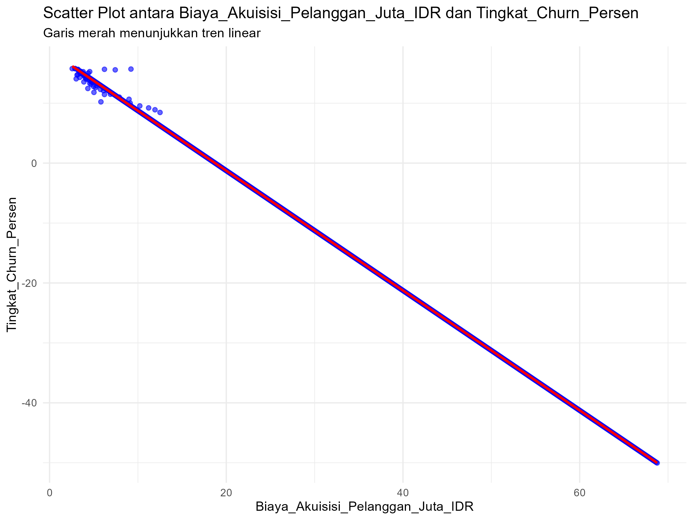
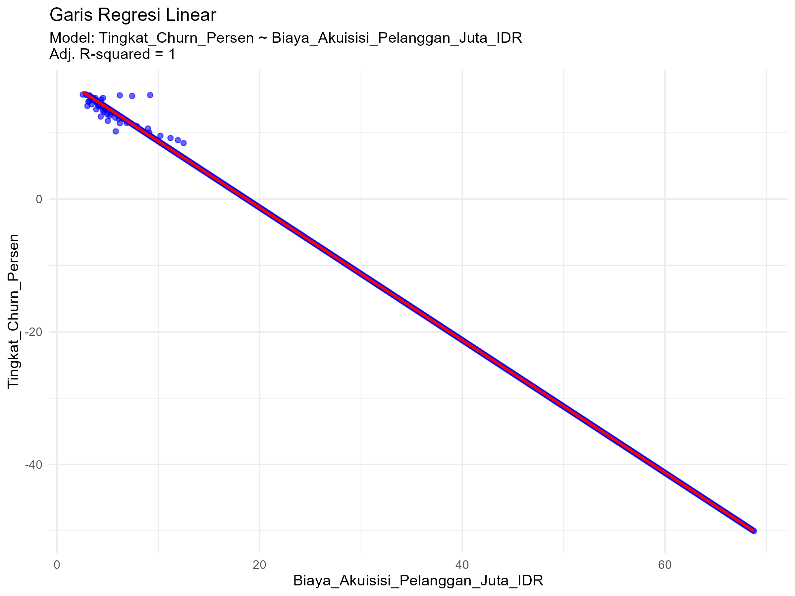

# Tugas Analisis Statistik: Deskriptif, Korelasi, dan Regresi

## 1. Informasi Penyusun

- **Nama:** `[I GEDE EVAN WIRATAMA]`
- **NIM:** `[2515101112]`
- **Program Studi:** `[ILMU KOMPUTER]`
- **Mata Kuliah:** Statistika dan Probabilitas

---

## 2. Deskripsi Proyek

Dataset yang digunakan adalah data Dataset yang digunakan adalah data_startup.csv yang berisi data 
mengenai profil finansial startup. Adapun variabel yang saya gunakan yaitu : 

- Nilai_Pelanggan_Juta_IDR
- Biaya_Akuisisi_Pelanggan_Juta_IDR
- Tingkat_Churn_Persen

Tujuan analisis yaitu untuk memahami distribusi nilai pelanggan, menguji normalitas data, serta menganalisis
bagaimana biaya akuisisi mempengaruhi tingkat kehilangan pelanggan
---

## 3. Struktur Proyek

Proyek ini diorganisir ke dalam beberapa folder:
- `/data`: Berisi dataset mentah yang digunakan untuk analisis.
- `/scripts`: Berisi semua skrip R yang digunakan dalam analisis, diurutkan berdasarkan alur kerja.
- `/results`: Berisi output dari analisis, seperti plot, gambar, atau tabel ringkasan.

---

## 4. Cara Menjalankan Analisis

Untuk mereproduksi hasil analisis ini, ikuti langkah-langkah berikut:
1. Pastikan Anda memiliki R dan RStudio terinstal.
2. Buka proyek R ini di RStudio.
3. Instal paket yang diperlukan dengan menjalankan perintah berikut di konsol R:
   ```R
   # install.packages(c("tidyverse", "corrplot", "knitr"))
   ```
4. Jalankan skrip di dalam folder `/scripts` secara berurutan, mulai dari `01_data_preparation.R` hingga `05_analisis_regresi.R`.

---

## 5. Hasil dan Interpretasi

Di bagian ini, mahasiswa diharapkan untuk menyajikan dan menginterpretasikan hasil dari setiap tahap analisis.

### 5.1. Statistik Deskriptif
- **Ukuran Pemusatan (Mean, Median, Modus):**
  - Mean   : 100.16
  - Median : 98.87
  - Modus  : 10.11
  
  - Rata-rata nilai ekonomi pelanggan adalah Rp100,16 Juta.
    Nilai median yang dekat dengan mean menunjukkan pusat data yang stabil,
    namun modus sebesar 10.11 menunjukkan adanya kelompok besar pelanggan dengan nilai rendah.
  
- **Ukuran Sebaran (Standar Deviasi, Range, Kuartil):**
  - Standar Deviasi   : 59.81
  - Range             : 6.01 - 205.46
  - Kuartil           : Q;45.91, Q2;98.87, Q3;152.16
  
  - Data Nilai Pelanggan memiliki rentang sebaran yang sangat luas, mulai dari Rp6,01 Juta hingga Rp205,46 Juta (range),
    dengan tingkat variabilitas antar startup yang tinggi sebesar Rp59,81 Juta (standar deviasi),
    di mana 50% data terkonsentrasi pada nilai menengah antara Rp45,91 Juta (Q1) hingga Rp152,17 Juta (Q3).
    
- **Visualisasi (Histogram/Boxplot):**
  - 
  - Grafik histogram menunjukkan bahwa nilai pelanggan dalam data ini sangat bervariasi dan tidak berkumpul di satu titik saja
    (tidak membentuk pola lonceng simetris). Meskipun rata-ratanya sekitar 100,16, kita bisa melihat banyak startup yang nilai
    pelanggannya masih rendah di angka 10,11, sehingga sebaran datanya terlihat cukup lebar.

  -
  -Dari grafik boxplot, terlihat bahwa data kita "bersih" karena tidak ada titik-titik yang letaknya sangat jauh atau terpisah
   dari kelompok utama (tidak ada nilai yang menyimpang jauh). Sebagian besar startup (sekitar 50%) memiliki nilai pelanggan
   yang berada di rentang tengah, yaitu antara Rp45,91 Juta hingga Rp152,17 Juta.
   
### 5.2. Uji Normalitas
- **Hasil Uji Shapiro-Wilk:**
  - Nilai p-value = 7,607e-15 yaitu < 0,05
  - Karena nilai p-value sangat kecil (kurang dari 0,05), maka data kita dianggap tidak terdistribusi normal4.
    Atau, penyebaran nilai pelanggan pada startup ini tidak merata secara alami.
    
- **Plot Q-Q:**
  - 
  - Pada grafik Q-Q Plot, terlihat titik-titik data (kuantil sampel) tidak sepenuhnya menempel pada garis merah putus-putus,
    terutama di bagian ujung bawah dan ujung atas. Hal ini mengonfirmasi secara visual bahwa data memang memiliki pola sebaran yang berbeda dari distribusi normal standar.

### 5.3. Analisis Korelasi
- **Nilai Koefisien Korelasi:**
  - Korelasi Pearson:r = -0,9997852
  - Angka ini menunjukkan adanya hubungan negatif yang sangat kuat (hampir sempurna). Dalam bahasa sehari-hari, 
    artinya semakin besar biaya akuisisi yang dikeluarkan startup, maka semakin rendah tingkat churn atau jumlah pelanggan yang berhenti.
    
- **Visualisasi (Scatter Plot):**
  - 
  - Pada scatter plot, terlihat titik-titik data membentuk garis lurus yang menurun tajam dari kiri atas ke kanan bawah(high negative correlation). 
    Hal ini membuktikan bahwa kedua variabel ini sangat berkaitan erat satu sama lain.

### 5.4. Analisis Regresi
- **Model Regresi:**
  - Persamaan regresi: Y = b0 + b1 * X 
                     : Tingkat_Churn_Persen  =  18.73  - 1  *  Biaya_Akuisisi_Pelanggan_Juta_IDR
                     
  - Intercept (18.73): Jika biaya akuisisi adalah 0, maka tingkat churn diprediksi ada di angka 18.73%. 
    Slope (-1.00): Setiap kali startup menambah biaya akuisisi sebesar Rp1 Juta, maka tingkat churn diprediksi akan turun sebanyak 1%
    
- **Evaluasi Model (R-squared):**
  - (R-squared): 1 atau 100%
  - Nilai ini sangat tinggi, artinya model ini sangat akurat karena 100% perubahan pada tingkat churn bisa dijelaskan oleh biaya akuisisi.

- **Visualisasi (Garis Regresi pada Scatter Plot):**
  - 
  - Garis merah (garis regresi) menempel sangat pas pada titik-titik data, yang menandakan model prediksi ini sangat cocok dengan keadaan data aslinya.

---

## 6. Kesimpulan

Berdasarkan analisis ini, kita bisa melihat bahwa Biaya Akuisisi memiliki pengaruh yang sangat besar dan nyata dalam menekan angka churn (pelanggan berhenti).
Dengan model regresi yang sangat akurat, startup bisa memprediksi dengan baik berapa biaya yang harus disiapkan untuk menjaga agar pelanggan tidak pergi.
